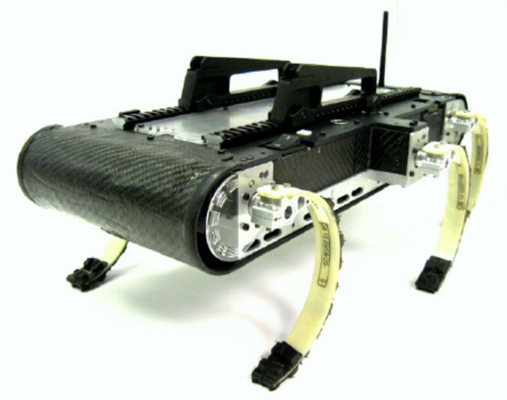
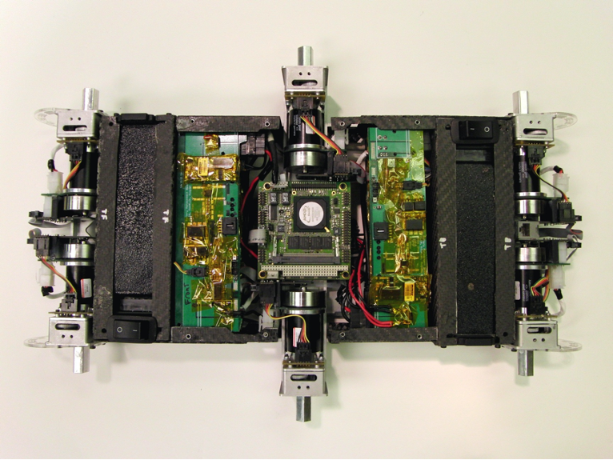
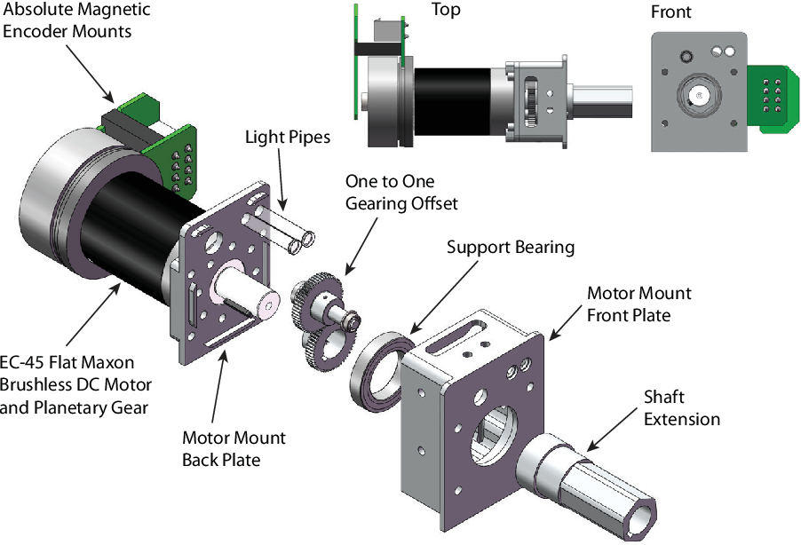
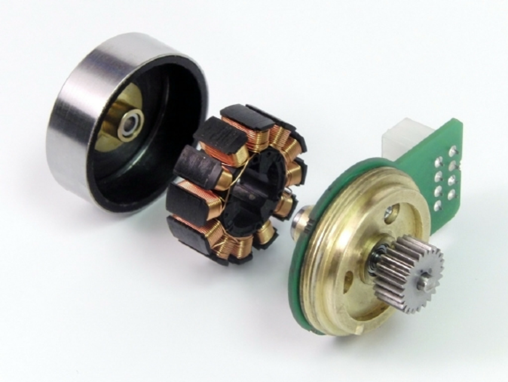

# rhex-leg
  GÖKHAN ORAL: ``The most important mechanical part of the robot is the leg``

## OBJECTIF :
create a mecanism for simulate rhex's leg.
- rhex uses pc104 board to control the six legs, here i'm just interessed on simulating the legs mechanism, using the low level inteface of Rhexlib, this is why i'm using arduino on my experiences
    

## Mechaninal design 
even if this repo tittle's rhex legs, the references used here for rhex mechecanicals parts where based on X-RHex 

   

### leg design and motor selection 

the X-RHex version uses high-torque, flat “pancake-style” brushless motors offered by Maxon Motors3.

### Control Electronics

this version uses also a Advanced Motion Controls (AMC) DZRLATE-20L080 motor controller. The DZRALTE-020L080 digital servo drive is designed to drive brushed and brushless servomotors, stepper motors, and AC induction motors from a compact form factor ideal for embedded applications. This motor controller comes preprogrammed with a variety of control modes that allow for quick testing of control strategies with limited custom code. These control schemes include position and velocity PID-F, current, voltage, rate limiter, current limiter, PVT 

## A closed loop PID controller

### PD controller in position
### pure current loop
### position-around-velocity controller